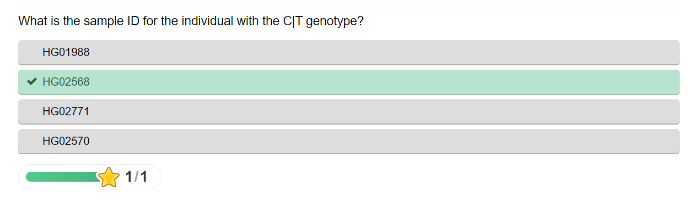

# Actividad 1 del máster de bioinformática VIU.

## Parte 1: Explorar recursos  del NCBI: *LCT1*

### 1. Encuenctra el gen de la lactasa humano en las bases de datos biológicas del repositorio NCBI y contesta las siguientes preguntas:

* 1.1. ¿Cuáles son las 5 primeras líneas de la secuencia? (desde el archivo .fasta)

* 1.2. ¿Cuál es el número de exones que presentan este gen?

### ***Revisar***

**Esta pregunta posiblemente esté mal interpretada, yo enseño los exones, pero pregunta el núemro de estos!!**

* 1.3. ¿Cuáles son los dos principales tejidos donde se expresa y su nivle de expresión relativo?

Parece ser que los principales tejidos en los que se encuentran son el duodemo y el intestino delgado.

* 1.4. Nombra los dos genes que se sitúan up-stream y down-stream de la lactasa.

    * Up stream se encontraría el gen MCM6.

    * Down stream se encontraría el gen UBXN4.

* 1.5. ¿Qué número de variantes consideradas patogénicas aparecen en la base de datos del NCBI ClinVar?

Parece ser que existen 23 variantes patogénias en ClinVar:

## Parte 2: Exlorar recursos del EMBL-EBI:

### 2) Actividad basada en el E-learning training del EMBL, concretamente en su actividad de "A journey through bioinformatics" [1]. Se debe encontrar las respuestas a los 8 retos propuestos.

[Pulsa para la ubicación de la actividad](https://www.ebi.ac.uk/training/online/courses/a-journey-through-bioinformatics/)

**Realizar y subir al aula un documento con las respuestas.**

* **Desafío 1**, enunciado:

     
    
* Búsqueda:

    

* Resultado:

    

* **Desafío 2**, enunciado:

     
    
* Búsqueda, en sample genotypes he descargado los datos y en excel he filtrato en la columna del genotipo para encontrar el individuo C|T:

    

* Resultado:

    

* **Desafío 3**, enunciado:

     
    
* Búsqueda:

Artículo:

Número de acceso del nucleótido, (Sección de protocolos):

* Resultado:

* **Desafío 4**, enunciado:

 
    
* Búsqueda:

* Resultado:

* **Desafío 5**, enunciado:

 
    
* Búsqueda:

* Resultado:

* **Desafío 6**, enunciado:

 
    
* Búsqueda:

* Resultado:

* **Desafío 7**, enunciado:

 
    
* Búsqueda:

* Resultado:

* **Desafío 8**, enunciado:

 
    
* Búsqueda:

Había que hacer una serie de filtros: -> journal (science) -> Experimental Information (EM microscope model)

* Resultado:

**Es obligatorio presentar junto a la respuesta correcta, una captura de pantalla señalando claramente el lugar donde se ha encontrado la respuesta (por ejemplo, un círculo resaltado con color)**

## Parte 3: Obtener un listado de archivos .fastaq mediante terminal.

* 3.1) Estás iniciando un nuevo proyecto y necesitas obtener un conjunto de archivos de un trabajo previo. Debes obtener los runs asociados al BioProject con accession number PRJNA298959.

 * 3.2) Crea un nuevo enviroment para tu proyecto, nómbralo "envAP1"

* 3.3) Utiliza la herramienta fastaq-dump desde este enviroment y descarga los archivos fastq (*all runs*) proporcionando un archivo con el listado de los identificadores que necesitas (SRR_Acc_List.txt). Proporciona una captura de pantalla en la que aparezca el terminal con: el prompt, el comando utilizado y el resultado obtenido.
